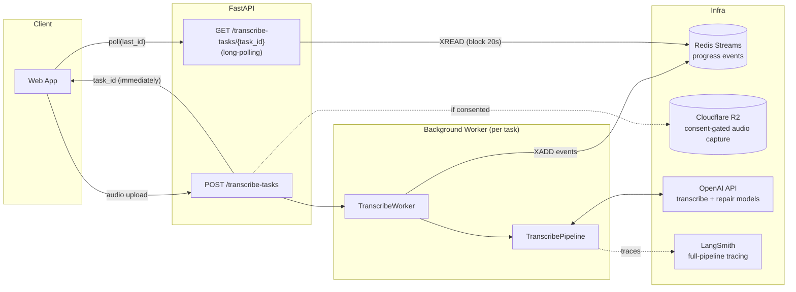
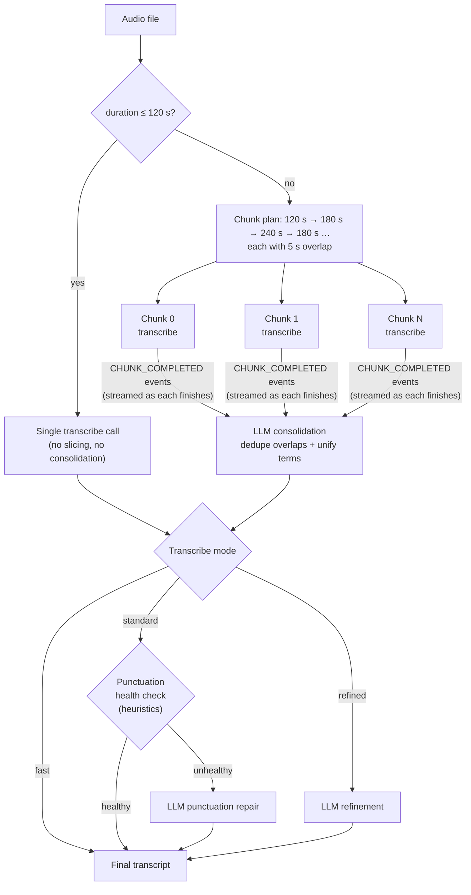

# Jin-T Backend — Bilingual Speech-to-Text Service

FastAPI backend for **Jin-T**, a speech-to-text web app built for **code-switched Chinese–English dictation** (the way people in Taiwan actually speak: 中文 sentences with English technical terms mixed in).

It turns a single raw audio upload into a clean, traditional-Chinese transcript with correct 中英 spacing and punctuation — streaming partial results to the client while long recordings are still being processed.

**Highlights at a glance**

| Problem | Solution in this repo | Result |
|---|---|---|
| Transcription models truncate / degrade on long audio (attention ceiling) | **Chunked scatter-gather pipeline**: ffmpeg segmentation → parallel transcription → LLM consolidation | No practical length ceiling; a 20-min recording transcribes as reliably as a 2-min one |
| User stares at a spinner for minutes | **Per-chunk streaming** over Redis Streams with warm-up chunk sizing (first chunk = 120 s) | Time-to-first-token **~7 s on a 20-minute recording** |
| LLM post-processing is unstable (~25% output-failure rate observed via tracing) | **Code + LLM fallback architecture**: deterministic post-processing always runs; a rule-based quality gate triggers conditional LLM repair | Stable output quality at a fraction of the LLM cost |
| Silent audio triggers model hallucination | Empty-fence normalization + all-silent short-circuit (skip consolidation entirely) | No fabricated text on silence |
| Free tier abuse / key security | Redis sliding-window quotas (device **and** IP), **RSA-encrypted** BYO OpenAI key | Free tier stays affordable; user keys never travel in plaintext |

Every LLM step is traced end-to-end with **LangSmith** — the failure analysis that motivated the hybrid architecture came directly from those traces.

---

## System Architecture



Key decision: the upload request returns a `task_id` immediately and all heavy work happens in a background worker. Progress and results flow through a **Redis Stream** per task, which the client reads via long-polling with a cursor (`last_id`) — so a dropped connection or page refresh resumes exactly where it left off, something plain SSE can't do without extra bookkeeping.

## The Transcription Pipeline

### Scatter-gather over overlapping chunks

Long audio is sliced with ffmpeg into overlapping chunks that are transcribed **in parallel** (bounded by a semaphore), then stitched back together by a consolidation LLM that resolves the 5-second overlaps and unifies terminology across chunk boundaries.



Design choices worth noting:

| Choice | Why |
|---|---|
| **Warm-up chunk sizes** (120 s, 180 s, 240 s, then 180 s steady-state) | The first chunk finishes fastest → first visible text in ~7 s, while later, larger chunks keep the total API-call count low |
| **5 s overlap between chunks** | A cut mid-word would corrupt both sides; the overlap gives the consolidation LLM context to stitch seamlessly |
| **LLM consolidation instead of string concat** | Overlap dedup is not a string problem — the same speech transcribes slightly differently in two chunks; terminology can also drift between chunks |
| **Duration probe with decode fallback** | Some containers carry no duration header; the probe falls back to decoding (run in an executor so it never blocks the event loop) |
| **≤ 120 s → single call** | Slicing a file that fits in the first chunk would just re-encode it and run consolidation with nothing to stitch; the threshold is *derived from* the first chunk size, so the two can't drift apart |

### Code + LLM fallback: cost-tiered post-processing

LangSmith traces showed ~25% of raw transcripts had quality issues (missing punctuation, simplified characters, cramped 中英 boundaries). Fixing everything with an LLM would be expensive *and* unstable — the repair model itself sometimes misbehaves. So post-processing is tiered:

| Tier | Mechanism | Runs |
|---|---|---|
| 1. Deterministic code | Simplified→Traditional conversion (`zhconv`), 中英 spacing insertion, empty-markdown-fence normalization | **Always**, per chunk |
| 2. Rule-based quality gate | Punctuation health heuristics (ending punctuation, semantic-units-per-punctuation ratio, short-text exemption) | Always, on the full transcript (`standard` mode) |
| 3. Conditional LLM repair | `gpt-4.1-nano` punctuation fix / refinement, temperature 0 | **Only when the gate fails** (or in `refined` mode) |

Cheap deterministic code handles the common case; the LLM is a targeted fallback, invoked only when heuristics prove the output is broken. The gate outcome is recorded as trace metadata, so the fallback rate is measurable, not guessed.

### Silence-hallucination guard

Transcription models hallucinate plausible sentences on silent input, and the consolidation model can amplify that. Two layers prevent it:

1. Per chunk: responses that are only an empty markdown fence (```` ```plaintext ``` ````) are normalized to empty strings and tagged as silent in the trace.
2. Whole task: if **every** chunk is silent, the consolidation LLM call is skipped entirely and the result is `""` — no LLM ever sees the empty input.

## Transcribe Modes

| Mode | Per-chunk code post-processing | Consolidation | Punctuation gate + repair | LLM refinement |
|---|:-:|:-:|:-:|:-:|
| `fast` | ✅ | ✅ | — | — |
| `standard` | ✅ | ✅ | ✅ | — |
| `refined` | ✅ | ✅ | — | ✅ |

## Free Tier, Rate Limiting & Key Security

Two ways to use the service:

- **Bring your own OpenAI key** — the key is **RSA-encrypted in the browser** and only decrypted server-side (PEM private key from env); it never travels or logs in plaintext. No quotas.
- **Free tier** (requires consent to data collection) — server-funded key, guarded by layered Redis quotas keyed by **both device ID and client IP** (IP resolved behind Cloudflare via `CF-Connecting-IP`):

| Rule | Window | Limit |
|---|---|---|
| Single audio duration | per request | 30 min |
| Per-device total duration | 24 h | 30 min |
| Per-IP total duration | 24 h | 60 min |
| Per-device transcribe count | 1 h | 5 |
| Per-IP transcribe count | 1 h | 20 |

All rules are checked in one Redis pipeline round-trip, then updated in a second — rejection messages include the exact retry time in Taipei timezone.

Consent also gates two things: raw-audio capture to Cloudflare R2 (for building an evaluation dataset) and LangSmith tracing — users who don't consent are never traced.

## Observability

Every stage is a named LangSmith run: `LLM1_Transcribe`, `LLM2_Consolidate_Chunks_Text`, `LLM2a_Fix_Punctuation`, `LLM2b_Refine_Transcript`, plus tool-level runs for each deterministic post-processor. Per-chunk transcripts, silence flags, gate decisions, and model names are attached as run metadata — which is what made the 25% failure-rate diagnosis (and the resulting architecture) possible in the first place.

## Tech Stack

| Layer | Choice |
|---|---|
| API | FastAPI (async), Pydantic v2 |
| Task streaming | Redis Streams (`XADD` / blocking `XREAD`), long-polling with cursor |
| Audio | ffmpeg (slicing, duration probe with decode fallback) |
| LLM | OpenAI `gpt-4o-mini-transcribe` + `gpt-4.1-nano` (repair/consolidation, temp 0) |
| Resilience | `tenacity` retries (exponential backoff on connection/rate-limit errors), worker semaphore |
| Observability | LangSmith (`@traceable`, `wrap_openai`, run-tree metadata) |
| Storage | Cloudflare R2 (consent-gated audio capture) |
| Security | RSA (PKCS1v15) encrypted BYO API keys |
| Packaging | Docker (python-alpine + ffmpeg), docker-compose with Redis |

## Project Layout

```
app/
├── main.py                  # FastAPI app, lifespan-managed Redis connection
├── config.py                # models, chunk sizing, quotas, thresholds — all in one place
├── dependencies.py          # DI chain: file validation → usage config → rate limiting
├── models.py                # Pydantic/TypedDict models, stream event contract
├── routers/
│   ├── transcribe.py        # POST /transcribe-tasks + long-polling progress endpoint
│   ├── api_key.py           # BYO-key validity check
│   └── livez.py             # health probe
├── workers/
│   └── transcribe_worker.py # task orchestration: chunk planning, scatter-gather, mode dispatch
├── pipelines/
│   └── transcribe_pipeline.py # slice → transcribe → post-process → consolidate (traced)
├── services/
│   ├── transcribe_stream.py # Redis Stream event emitter/reader
│   ├── llm_client.py        # all OpenAI calls, one traced function per model role
│   └── audio_storage.py     # R2 capture
├── lib/                     # pure helpers: audio tools, transcript processors, rate-limit rules
├── prompts/                 # versioned prompt files, one per model role
└── tests/                   # pytest suite (~45 tests) for pipeline, validation, API
```

The boundary discipline: `routers` handle HTTP, `workers` orchestrate, `pipelines` own the transcription domain flow, `services` wrap external systems, `lib` is pure logic — which is also what keeps the pipeline unit-testable without a network.

## Running Locally

Requires Docker (ships with ffmpeg + Redis via compose).

Create a `.env` with at least:

| Variable | Purpose |
|---|---|
| `ALLOWED_ORIGINS` | CORS allowlist for the frontend |
| `FREE_TIER_OPENAI_API_KEY` | Server-funded key for free-tier requests |
| `API_KEY_ENCRYPTION_PRIVATE_KEY` | RSA private key (PEM) for decrypting BYO keys |
| `LANGSMITH_TRACING` / `LANGSMITH_API_KEY` / `LANGSMITH_PROJECT` | Tracing (optional) |
| `R2_*` | Cloudflare R2 credentials for consent-gated audio capture (optional) |

```bash
docker compose up --build
```

API at `http://localhost:8003`, interactive docs at `/docs`.

```bash
# tests
pytest app/tests -v
```

## Related Writing & Talks

Deeper dives into the engineering decisions in this repo, by the author:

- **"How I Designed a Code + LLM Hybrid Architecture to Fix Unstable AI Output Quality"** — cost-tiered optimization: deterministic code, prompt iteration, and error-rate-driven conditional LLM repair. ([Medium](https://medium.com/@wytdong/ai-application-%E9%96%8B%E7%99%BC%E5%AF%A6%E6%88%B0-%E6%88%91%E6%98%AF%E5%A6%82%E4%BD%95%E8%A8%AD%E8%A8%88-code-llm-%E6%B7%B7%E5%90%88%E6%9E%B6%E6%A7%8B-%E8%A7%A3%E6%B1%BA-openai-api-%E7%9A%84%E5%9B%9E%E6%87%89%E4%B8%8D%E7%A9%A9%E5%95%8F%E9%A1%8C-c71e1b36a6d1))
- **Talk: Agent Observability & Evaluation** — tracing, evaluation datasets, and failure analysis for LLM systems.
