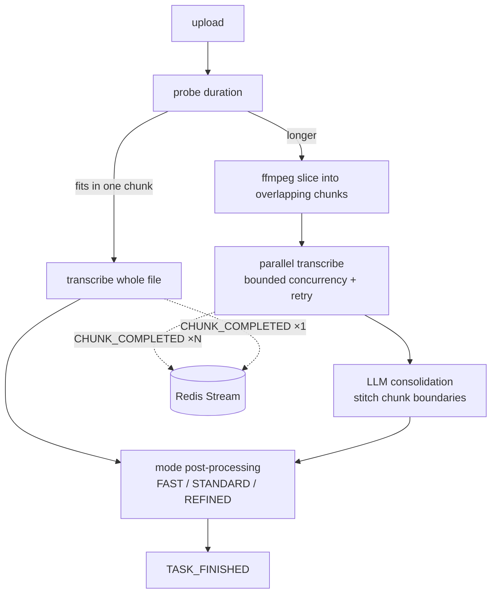
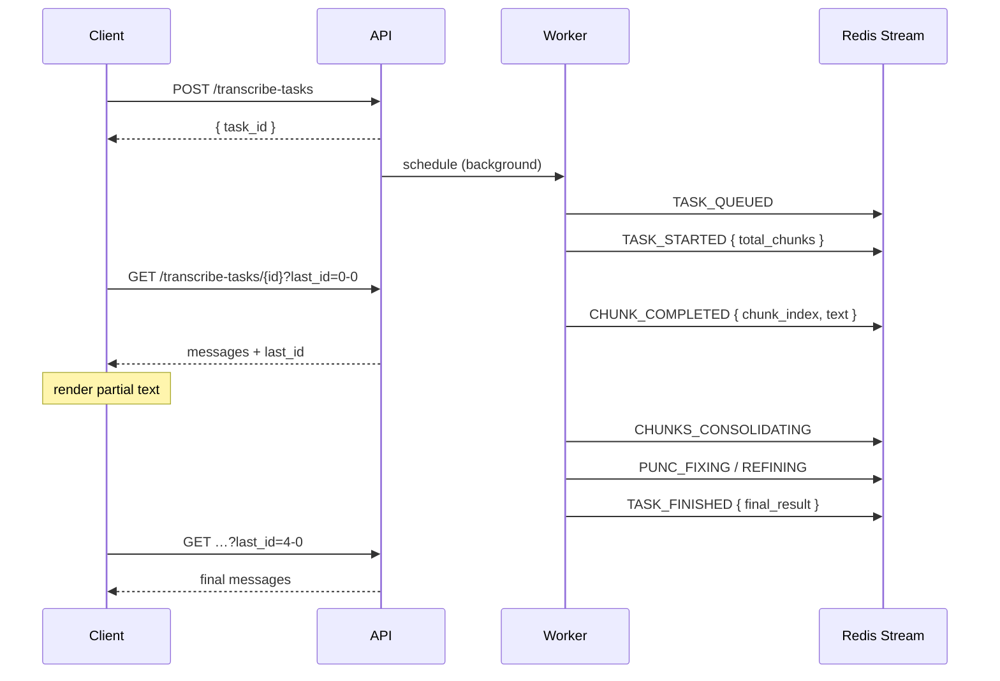

# JinJinTi — Transcription Backend

FastAPI service behind [JinJinTi (晶晶體)](https://github.com/wei-yiting/jin-t-frontend), a
speech-to-text tool for mixed Chinese-English technical dictation. It turns an uploaded or
recorded audio file into a cleaned-up transcript, streaming partial results to the client while
the work is still in progress.

## Quick start

```bash
cp .env.example .env   # then fill in the values (see Configuration)
docker compose up -d --build
curl localhost:8003/livez
```

The compose stack runs the API (port 8003) and Redis. `ffmpeg` ships inside the image.

## The transcription pipeline

This is the core of the service, and the part worth understanding before changing anything else.

### The problem it solves

The transcription model has a ceiling on **output** length, not input length. Feed it a long
recording and it will accept the whole file, transcribe the beginning, and stop — without
raising an error. The task reports success while silently returning a fraction of the content.

Measured on a 14.4-minute recording:

| | Single call | Chunked pipeline |
|---|---|---|
| Reported status | completed | completed |
| Wall clock | 28s | 63s |
| Characters returned | ~300 | ~9,800 |

The single-call version was faster because it silently skipped 97% of the work. The pipeline
below exists to fix that data loss, not to make anything faster.

### Routing: chunk only when chunking buys something

Slicing costs a full re-encode of the source file, and consolidation costs an LLM call. Neither
pays off when the audio already fits in one chunk, so the worker measures the duration first and
routes on it.



The threshold is derived, not hardcoded:

```python
SHORT_AUDIO_MAX_DURATION_MS = INITIAL_CONCURRENT_CHUNK_DURATIONS_SECONDS[0] * 1000
```

It expresses one invariant — *if it fits in a single chunk, don't chunk* — and stays correct if
the chunk sizing is ever retuned.

### Chunk layout: progressive sizing with overlap

Chunks are not uniform. The first is the shortest so the first text reaches the user soonest;
later chunks grow to amortise per-call overhead. Consecutive chunks overlap by 5 seconds so that
a sentence cut at a boundary appears **complete** in both neighbours.

| Chunk | Range | Length | Overlaps previous by |
|---|---|---|---|
| 0 | 0–120s | 120s | — |
| 1 | 115–295s | 180s | 5s |
| 2 | 290–530s | 240s | 5s |
| 3+ | 525–705s, … | 180s | 5s |

Each chunk starts 5 seconds before its predecessor ended. Zooming in on one boundary shows why
that matters — without the overlap, a phrase split across the cut is incomplete on both sides:

```
                          110s   115s   120s   125s
 without overlap
   chunk 0  ────────────────────────────┤          … 切成多個 chunk，chunk 之
   chunk 1                              ├────────      間有五秒的 overlap …
                                    the cut ↑          neither side is a whole phrase

 with 5s overlap
   chunk 0  ────────────────────────────┤          … chunk 之間有五秒的 overlap
   chunk 1                       ├───────────────      chunk 之間有五秒的 overlap …
                                 └ 115s              both sides carry the whole phrase,
                                                     consolidation drops the duplicate
```

### Consolidation: stitching the seams

Chunk transcripts are tagged by index and handed to an LLM that removes the overlap and rejoins
the broken sentence:

```
<chunk index="0">…chunk 之間有五秒的 overlap，這樣 consolidation 的時候才能把邊界的句子接起來。</chunk>
<chunk index="1">這樣 consolidation 的時候才能把邊界的句子接起來。接下來是 parallel transcription…</chunk>
```

Chunks are transcribed concurrently under `asyncio.Semaphore(3)`, with exponential-backoff retry
on connection and rate-limit errors.

### Streaming: an event log, not a status field

Because chunks finish at different times, partial transcripts exist long before the task does.
To deliver them, progress is modelled as an **append-only event log** in a Redis Stream rather
than a mutable status field. The client long-polls with a cursor and receives only what it has
not seen.



| Event | Payload |
|---|---|
| `TASK_QUEUED` | — |
| `TASK_STARTED` | `total_chunks` |
| `CHUNK_COMPLETED` | `chunk_index`, `text` |
| `CHUNKS_CONSOLIDATING` | — |
| `PUNC_FIXING` / `REFINING` | `consolidated_text` |
| `TASK_FINISHED` | `final_result` |
| `TASK_FAILED` | `error` |

The single-call path emits the same events minus `CHUNKS_CONSOLIDATING`, reporting
`total_chunks: 1`. Clients therefore never need to know which path the backend took.

### Post-processing modes

Both paths converge here. The design keeps deterministic work in code and escalates to an LLM
only where judgement is actually required.

| Mode | Behaviour |
|---|---|
| `FAST` | Code only: Simplified → Traditional, spacing between Chinese and Latin text |
| `STANDARD` | Code, plus a heuristic punctuation-health check that gates a conditional LLM repair |
| `REFINED` | Code, plus an unconditional LLM polish pass |

### Measuring duration

Browser `MediaRecorder` uploads stream their container as they record and never write a duration
header, so `ffprobe` returns an empty format object for them. The probe falls back to decoding
the file through the null muxer and reading the final progress timestamp. Because that decodes
the whole file, the probe runs in an executor rather than on the event loop.

## API

| Method | Path | Purpose |
|---|---|---|
| `POST` | `/transcribe-tasks?mode={fast\|standard\|refined}` | Accept audio, schedule the worker, return `task_id` |
| `GET` | `/transcribe-tasks/{task_id}?last_id={cursor}` | Long-poll the event stream from a cursor |
| `POST` | `/validate-openai-api-key` | Check a user-supplied key |
| `GET` | `/livez` | Liveness probe |

Request headers on `POST /transcribe-tasks`: `X-Device-Id`, `X-Audio-Duration`,
`X-Consent-Data-Collection`, `X-Custom-Openai-Api-Key` (empty to use the free tier).

## Configuration

Environment variables:

| Variable | Purpose |
|---|---|
| `FREE_TIER_OPENAI_API_KEY` | Key used when the caller supplies none |
| `API_KEY_ENCRYPTION_PRIVATE_KEY` | RSA private key for decrypting user-supplied keys |
| `REDIS_URL` | Defaults to `redis://localhost:6379/0` |
| `ALLOWED_ORIGINS` | Comma-separated CORS origins |
| `LANGSMITH_TRACING` | `true` to enable tracing |

Pipeline tuning lives in `app/config.py`:

| Constant | Meaning |
|---|---|
| `INITIAL_CONCURRENT_CHUNK_DURATIONS_SECONDS` | Length of the first chunks, shortest first |
| `SUBSEQUENT_CHUNK_DURATION_SECONDS` | Length of every chunk after those |
| `AUDIO_CHUNK_OVERLAP_MS` | Overlap between neighbouring chunks |
| `MAX_CONCURRENT_TRANSCRIBE_WORKERS` | Semaphore bound on parallel transcription |
| `SHORT_AUDIO_MAX_DURATION_MS` | Derived; do not hardcode |

## Layout

```
app/
├── routers/      HTTP surface only
├── workers/      task orchestration — routing, scatter-gather
├── pipelines/    transcription steps and their tracing
├── services/     LLM client, Redis stream, audio storage
├── lib/          pure helpers — ffmpeg wrappers, text processing
├── prompts/      LLM instructions as text files
└── tests/
```

## Tests

```bash
pytest app/tests/                                   # all
pytest app/tests/test_transcribe_pipeline.py        # one file
pytest app/tests/test_transcribe_pipeline.py::TestShortAudioBypassesChunking
```

Tracing is force-disabled in `conftest.py` so the suite never performs network I/O.

## Known limitations

- The 25MB upload cap still applies; chunking removes the model's output ceiling, not the
  upload limit.
- A chunk that fails after retries fails the whole task — there is no per-chunk resume.
- Consolidation occasionally leaves a boundary overlap unstitched when the overlapping text is a
  short, non-distinctive phrase. Long distinctive overlaps stitch reliably. Deliberate speaker
  repetition is preserved correctly, so this shows up as cosmetic duplication rather than
  content loss.
